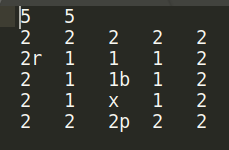
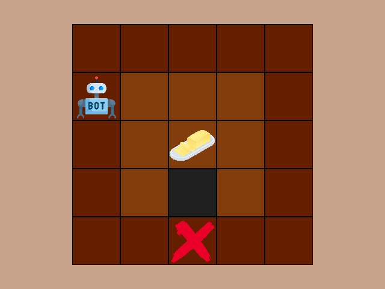

[![Contributors][contributors-shield]][contributors-url]

<!-- TABLE OF CONTENTS -->
<details>
  <summary>Table of Contents</summary>
  <ol>
    <li>
      <a href="#gimme-butter">Gimme Butter</a>
      <ul>
        <li><a href="#built-with">Built With</a></li>
      </ul>
    </li>
    <li>
      <a href="#getting-started">Getting Started</a>
      <ul>
        <li><a href="#requirements">Requirements</a></li>
        <li><a href="#run-the-game">Run the Game</a></li>
      </ul>
    </li>
    <li><a href="#contributing">Contributing</a></li>
    <li><a href="#license">License</a></li>
    <li><a href="#contact">Contact</a></li>
  </ol>
</details>

<!-- Gimme Butter -->
# Gimme Butter

This game is a practice of three AI search algorithms:

 - A* Algorithm
 - Bidirectional BFS
 - Iterative Deepening Search

The game is about a robot which tries to serve customer ASAP. At first, There is a bunch of foods on a table and all foods are given to the customers previously except for butter. This robot's duty is to give butter to the customer by putting it on a specific position on the table.

The robot's sensors gets a first perception of items on table at first.  The sensor driver puts that perception as a text file with the following format into a specific directory:



First line is width and height of table. Other lines describes the table items. Items are these:
 - Numbers are cost of moving over that part of table.
 - 'r' is the position of the robot itself.
 - 'b' is the first position of a butter.
 - 'p' is a point to put a butter on it.
 - 'x' is block with other foods
 
After finding shortest path, the output will be something like this:



<br>

<!-- Bulit With -->
## Built With
This project is created by pure <a href="https://www.python.org">python3</a>.

# Getting Started
In this section we are explaining how to run this game.

## Requirements
Before running you need to install required libraries. You can install these libraries by requirements.txt file.
By the following command you can install.

```
$ pip install -r requirements.txt
```

## Run the Game
Use one of these command to run the game:

```
$ python3 main.py a_star
```

```
$ python3 main.py bd_bfs
```

```
$ python3 main.py ids
```

In Windows you can use 'python' instead of python3.
In Linux you can also run by one of these commands:

```
$ ./main.py a_star
```

```
$ ./main.py bd_bfs
```

```
$ ./main.py ids
```

<p align="right">(<a href="#top">back to top</a>)</p>


<!-- CONTRIBUTING -->
# Contributing

If you have a suggestion that would make this better, please fork the repo and create a pull request. You can also simply open an issue with the tag "enhancement".
Don't forget to give the project a star! Thanks again!

1. Fork the Project
2. Create your Feature Branch (`git checkout -b feature/AmazingFeature`)
3. Commit your Changes (`git commit -m 'Add some AmazingFeature'`)
4. Push to the Branch (`git push origin feature/AmazingFeature`)
5. Open a Pull Request

<p align="right">(<a href="#top">back to top</a>)</p>


<!-- LICENSE -->
# License

Distributed under the MIT License. See `LICENSE.txt` for more information.

<p align="right">(<a href="#top">back to top</a>)</p>


<!-- CONTACT -->
# Contact

Mahdi Rezaie - [@mahdirezaie336](https://twitter.com/mahdirezaie336) - mahdi.rezaie.336@gmail.com

Project Link: [https://github.com/mahdirezaie336/GimmeButter](https://github.com/mahdirezaie336/GimmeButter)

<p align="right">(<a href="#top">back to top</a>)</p>

